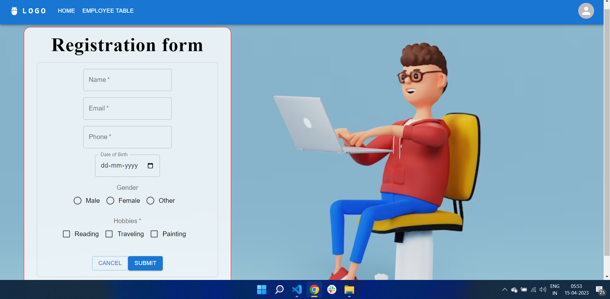

# Getting Started with Cloning the Repository
    using 'git clone' command

## Install the npm packages
    using 'npm install'

### Start the json-server to perform the CRUD operations
    using 'npx json-server --watch db.json --port 8000'

#### Now Run the Client side as it is deployed so, you can start locally or by using deployed link.
    for start locally 'npm start' & with deployed link use 'https://terisoft-round2.vercel.app/'

##### Now start exploring my wonderfull App do POST requests
    

##### Now after Filling all the fields it will redirect to Table page where all the data will be visible in table format
    .png)

#### Now you can view details of any employee or delete it from database
    .png)

#### And lastly you can perform the Update operation, the modal will open and close
    .png)
